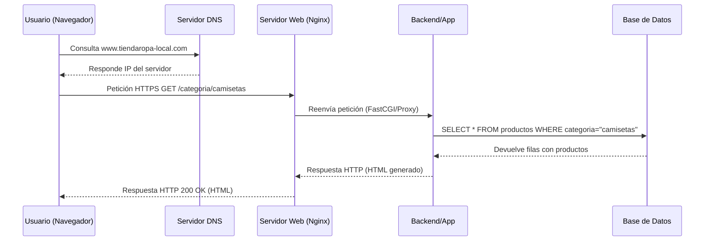

# Docker_IAW
Clases de Implementación de aplicaciones web
## Proyecto: Publicación de la primera página web de una tienda local

### 1. Análisis de arquitectura (modelo cliente-servidor)

La empresa es una **tienda de ropa local** que quiere publicar su primera página web con:

- Catálogo de productos (ropa, calzado, complementos).
- Búsqueda y filtros por categoría, talla y precio.
- Posibilidad futura de registro de clientes y carrito de compra.

Para dar servicio a esta web se utilizará el modelo **cliente-servidor**:

- **Cliente (frontend)**:
  - Navegador web del usuario (Chrome, Firefox, Edge, navegador móvil…).
  - Envía peticiones HTTP/HTTPS al servidor y muestra el contenido (HTML, CSS, JS).

- **Servidor (backend)**:
  - Equipo físico o servidor en la nube con sistema operativo **Linux** (por ejemplo, Ubuntu Server).
  - Ejecuta un **servidor web Nginx** que escucha en los puertos:
    - 80 → HTTP.
    - 443 → HTTPS (con cifrado TLS).
  - Recibe peticiones HTTP, decide qué recurso entregar (archivo estático o contenido generado dinámicamente) y devuelve una respuesta HTTP.

- **Componentes necesarios**:
  - **Servidor web Nginx**: gestiona las conexiones y las peticiones HTTP.
  - **Archivos estáticos**:
    - HTML (estructura de las páginas).
    - CSS (estilos y diseño).
    - JavaScript (interacción en el navegador).
    - Imágenes de productos y logotipos.
  - **Aplicación de servidor (backend dinámico)**:
    - Aplicación en PHP (con PHP-FPM), Python o Node.js encargada de generar contenido dinámico (catálogo, filtros, carrito, etc.).
  - **Base de datos**:
    - MySQL/MariaDB o PostgreSQL para guardar productos, usuarios y pedidos.
  - **DNS**:
    - Traduce `www.tiendaropa-local.com` a la IP del servidor.
  - **Certificado SSL/TLS**:
    - Permite cifrar las comunicaciones y usar HTTPS.

---

### 2. Tipología de la web: estática o dinámica

**Web estática**

- Las páginas son archivos HTML fijos.
- El servidor solo entrega archivos ya generados, sin lógica en el lado del servidor.
- Adecuada para:
  - Páginas informativas sencillas: “Quiénes somos”, “Dónde estamos”, “Contacto”.
- Ventajas:
  - Muy rápida.
  - Sencilla de configurar y mantener.
  - Menor superficie de ataque (no hay base de datos ni código de servidor).
- Inconvenientes:
  - Para actualizar productos hay que editar los HTML manualmente.
  - No permite funciones avanzadas como filtros complejos, login o carrito de compra.

**Web dinámica**

- El contenido se genera según la interacción del usuario y la información de la base de datos.
- Ejemplos:
  - Filtro por categoría (“camisetas”, “pantalones”) y tallas.
  - Búsqueda por nombre de producto.
  - Registro de usuarios, carrito de compra y panel de administración.
- Ventajas:
  - El catálogo se actualiza desde un **panel de administración**, sin tocar código.
  - Permite interactividad avanzada (carrito, usuarios, opiniones, etc.).
  - Escalable: se pueden añadir funcionalidades sin rehacer las páginas a mano.
- Inconvenientes:
  - Mayor complejidad técnica.
  - Más componentes que mantener (aplicación, base de datos).
  - Requiere más medidas de seguridad.

**Elección para la tienda**

La empresa necesita un **catálogo interactivo**, con posibilidad futura de:

- Registro de clientes.
- Carrito de compra y pasarela de pago.
- Panel de administración para gestionar productos.

Por estas razones, se elige una **web dinámica** que combine:

- Páginas informativas estáticas (quiénes somos, contacto).
- Un módulo dinámico para catálogo y futuras compras, conectado a una base de datos.

---

### 3. Selección tecnológica del servidor web

Se comparan tres opciones principales:

- **Apache HTTP Server**:
  - Muy popular y con mucha documentación.
  - Soporta módulos como `mod_php`, `mod_rewrite`, `mod_security`.
  - Muy usado en hostings compartidos.
  - Modelo de procesos que puede consumir más recursos con muchas conexiones.

- **Nginx**:
  - Diseñado para **alto rendimiento** y baja utilización de memoria.
  - Muy eficiente sirviendo contenido estático (imágenes, CSS, JS).
  - Excelente como **proxy inverso** hacia aplicaciones dinámicas (PHP-FPM, Node.js, Python…).
  - Configuración clara basada en bloques `server {}`.

- **IIS (Internet Information Services)**:
  - Servidor web de Microsoft para Windows Server.
  - Adecuado si todo el entorno es Microsoft (.NET, Active Directory…).
  - Menos habitual en hostings económicos Linux.

**Elección: Nginx**

Para una pequeña empresa con un servidor o hosting Linux, se selecciona **Nginx** porque:

- Ofrece **muy buen rendimiento** con muchas conexiones simultáneas usando pocos recursos.
- Permite una configuración sencilla y segura (límites de tamaño de petición, tiempos de espera, bloqueo de rutas sensibles).
.- Puede servir directamente los recursos estáticos y derivar las peticiones dinámicas al backend (PHP-FPM, Python, Node.js).
- Es uno de los servidores web más utilizados en producción, con una gran comunidad y soporte.

---

### 4. Funcionamiento del protocolo HTTP

**Flujo de una petición HTTP/HTTPS**:

1. El usuario escribe `https://www.tiendaropa-local.com/categoria/camisetas` en el navegador.
2. El navegador consulta al **servidor DNS** para obtener la IP de `www.tiendaropa-local.com`.
3. Se establece una conexión TCP con el servidor en:
   - Puerto 443 (HTTPS, con cifrado TLS).
4. El navegador envía una **petición HTTP** al servidor Nginx, por ejemplo:
   - Método: `GET`.
   - Ruta: `/categoria/camisetas`.
   - Versión: `HTTP/1.1` o `HTTP/2`.
   - Cabeceras: `Host`, `User-Agent`, `Accept`, cookies, etc.
5. El servidor **Nginx** recibe la petición y decide:
   - Si es un recurso estático (por ejemplo `/img/logo.png`), lo lee del sistema de ficheros y lo devuelve directamente.
   - Si es una ruta dinámica (por ejemplo `/categoria/camisetas`), reenvía la petición al **backend** (PHP-FPM o la aplicación correspondiente) usando FastCGI o proxy.
6. El **backend de la aplicación**:
   - Lee los parámetros (categoría = “camisetas”, filtros, etc.).
   - Consulta la **base de datos** para obtener los productos correspondientes.
   - Genera una respuesta (HTML o JSON) con el listado de productos.
7. El backend devuelve a Nginx una **respuesta HTTP** con:
   - Código de estado: `200 OK` si todo ha ido bien.
   - Cabeceras: tipo de contenido, políticas de caché, etc.
   - Cuerpo: el contenido HTML que verá el usuario.
8. Nginx envía la respuesta al navegador del cliente.
9. El navegador interpreta el HTML, descarga recursos adicionales (CSS, JS, imágenes) y los muestra en pantalla.

---

### 5. Seguridad y mantenimiento del servidor

**Buenas prácticas de seguridad**:

- Mantener actualizado:
  - El sistema operativo (Linux).
  - El servidor web (Nginx).
  - El lenguaje de programación y frameworks del backend.
- Usar **HTTPS** de forma obligatoria:
  - Instalar un certificado SSL/TLS (por ejemplo, Let’s Encrypt).
  - Redirigir automáticamente HTTP (puerto 80) a HTTPS (puerto 443).
- Configurar Nginx de forma segura:
  - Desactivar el listado de directorios.
  - Limitar el tamaño máximo de las peticiones.
  - Establecer tiempos de espera razonables.
  - Añadir cabeceras de seguridad (`X-Frame-Options`, `X-Content-Type-Options`, `Content-Security-Policy`, etc.).
- Gestionar correctamente usuarios y contraseñas:
  - Usar contraseñas robustas y, si es posible, autenticación en dos pasos.
  - Restringir el acceso SSH usando claves en lugar de contraseñas cuando sea posible.
  - Evitar trabajar como `root` y usar usuarios con permisos limitados.

**Mantenimiento y copias de seguridad**:

- Realizar **copias de seguridad periódicas** de:
  - La base de datos (productos, usuarios, pedidos).
  - El código de la aplicación y la configuración de Nginx.
- Guardar las copias en un lugar distinto al servidor principal (otro servidor o la nube).
- Probar de forma regular la restauración de una copia para asegurarse de que funciona.
- Monitorizar recursos (CPU, memoria, espacio en disco) y revisar los **logs** del servidor y de la aplicación para detectar errores o intentos de ataque.

---

### 6. Diagrama del flujo de la petición HTTP

El siguiente diagrama de secuencia representa el flujo de una petición HTTP/HTTPS desde el navegador del cliente hasta el servidor y la base de datos:

Este diagrama se puede exportar como imagen o incluir directamente en la memoria del proyecto si la herramienta utilizada soporta Mermaid.

